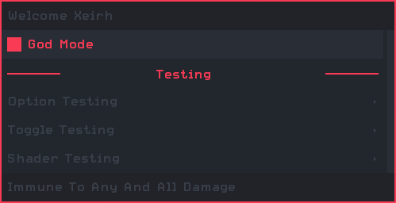
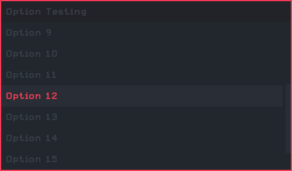
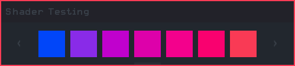

# M203
H1-Mod / H2M-Mod Menu Base

# CREDITS
- Apparition Structure Team:
  * `CF4_99` Main developer
  * `Extinct` Ideas, suggestions, constructive criticism
  * `ItsFebiven` Some ideas and suggestions
  * `Joel` Suggestions

- Special Thanks:
   * `Extinct` Using his slider system, web browser style scrollbar and some of his hud designs
   * `Candy` Too dirty with hud design, couldn't help but jack the category design
   * `DoktorSAS` For supplying the fix for hooks on servers
   * `Arctic` Main testing and testing on servers

# CONTROLS
- Check your controls in the option menu to see `< control >` keybinds
  * Open Menu: `<Aim Down Sight>` && `<Melee Attack>`
  * Scrolling: Up \ Down: `<Aim Down Sight>` or `<Attack>`
  * Scrolling: Left \ Right: `<Lethal Offhand>` or `<Tactical Offhand>`
  * Select: `<Use>`
  * Back: `<Melee Attack>`

# WHATS NEW?
- Added `Auto Verify`
- Added `Auto Archive`
- Added `Shader Option`
- Added `Dynamic Description`
- Improved `level.private_match`
- Improved `is_admin()`

