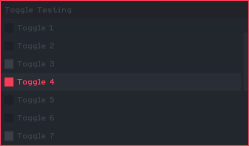

# M203
H1-Mod / H2M-Mod Menu Base

# CREDITS
- Apparition Structure Team:
  * `CF4_99` Main developer
  * `Extinct` Ideas, suggestions, constructive criticism
  * `ItsFebiven` Some ideas and suggestions
  * `Joel` Suggestions

- Special Thanks:
   * `Extinct` Using his slider system, web browser style scrollbar and some of his hud designs
   * `Candy` Too dirty with hud design, couldn't help but jack the category design
   * `DoktorSAS` For supplying the fix for hooks on servers
   * `Arctic` Main testing and testing on servers

# CONTROLS
- Check your controls in the option menu to see `< control >` keybinds
  * Open Menu: `<Aim Down Sight>` && `<Melee Attack>`
  * Scrolling: Up \ Down: `<Aim Down Sight>` or `<Attack>`
  * Scrolling: Left \ Right: `<Lethal Offhand>` or `<Tactical Offhand>`
  * Select: `<Use>`
  * Back: `<Melee Attack>`

# WHATS NEW?
- Added `Auto Verify`
- Added `Auto Archive`
- Added `Shader Option`
- Added `Dynamic Description`
- Improved `level.private_match`
- Improved `is_admin()`

# INSTALLING
- Aurora / H1-M
  - Download and drop into the `h1-mod/scripts/mp` directory and that is it, your done and ready to play.
    - If missing `scripts/mp` just create the folders.

- Horizon / H2M-M
  - Download and drop `user_scripts` inside `h2m-mod` directory. `H2M-M` does have a `scripts/mp` directory but anything inside this will be deleted after game restart.
    - If existing `user_scripts` directory, you can just throw the files into it. Note some other scripts might confict with the menu.

- Horizon Private Match Bypass
  - Place the file that is included inside `gametypes` into the `h2m-mod/maps/mp/gametypes` directory and after that, you're set to play in private match.
    - If missing `maps/mp/gametypes`, fear not, just create the folder and continue.

- Aurora / Horizon Dedicated Session
  - `level.private_match` will auto switch the verification system from `host check` to `guid check` depending on the session state, so you honestly don't have to do any work other than obtaining your `guid`.
    - How to obtain `guid`?
      - With Aurora you can use the built in function `print()`, with Horizon this is disabled, so you will have to use `self iprintln()` and manually type the guid.

    - Example
      - `print( self.guid );`
      - `self iprintln( self.guid );`

    - Place the `guid` into `level.guid_list`, this is an array so it can hold multiple `guids`, being friends, members ect...
      - After this enjoy.

